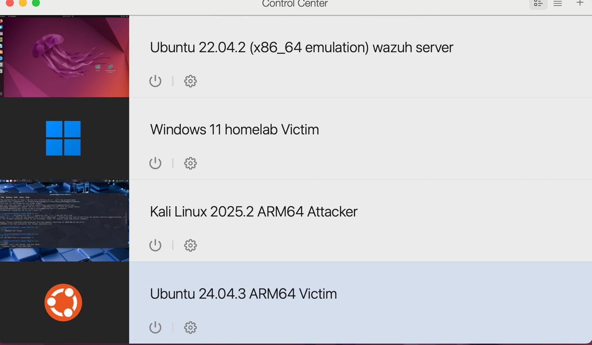
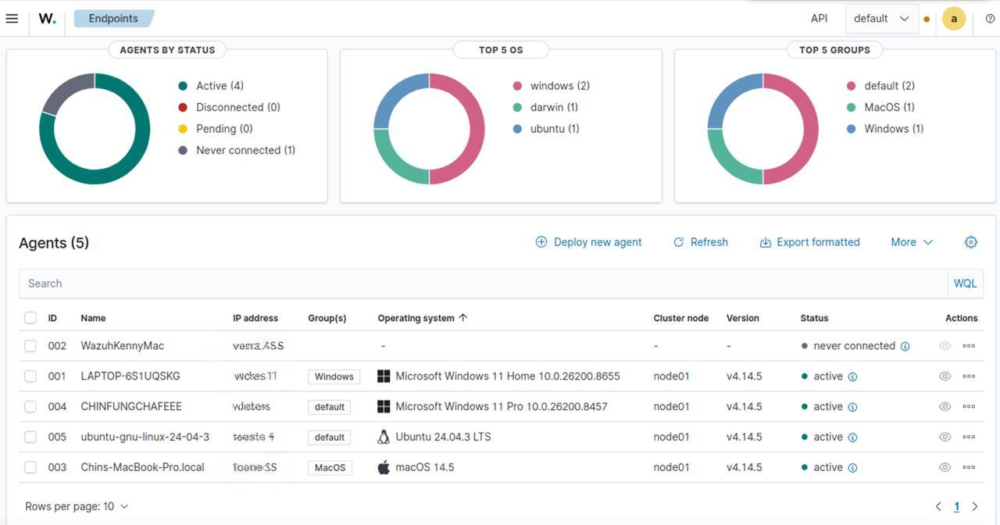
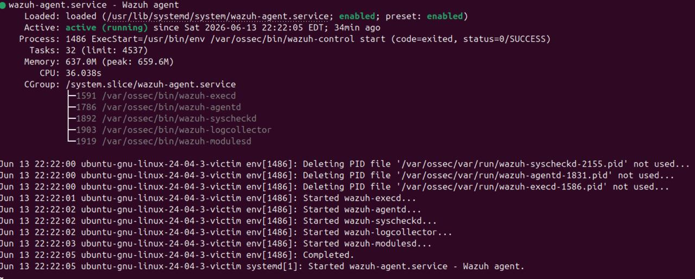
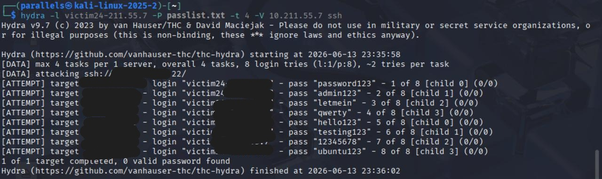
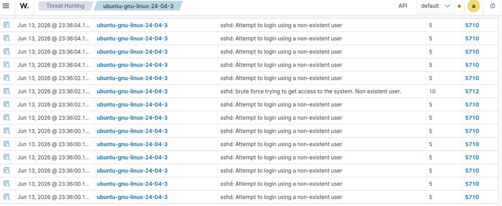
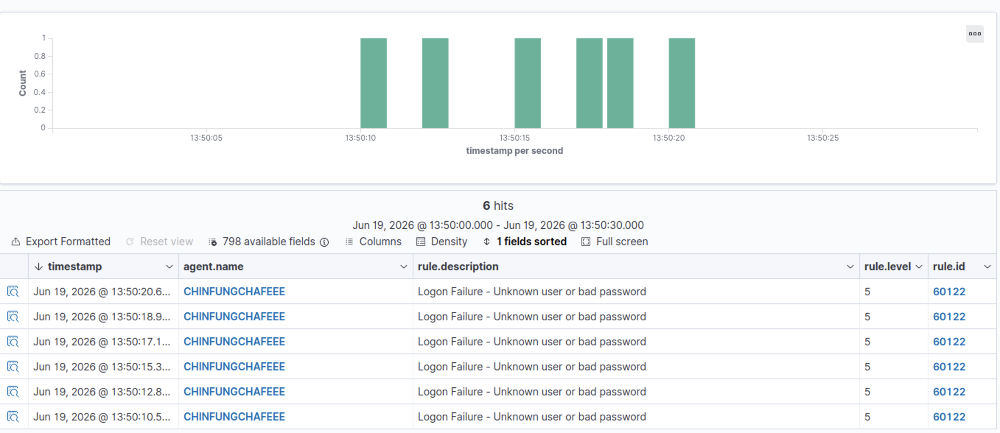

# Wazuh-homelab
A Wazuh-based SOC homelab built to practice SIEM monitoring, endpoint visibility, attack simulation, and alert investigation using Windows, Ubuntu, and Kali Linux virtual machines.

## Overview
This project simulates a small blue-team lab environment using Wazuh as the central SIEM/XDR platform. The goal is to build hands-on experience with endpoint monitoring, attack detection, and security investigation workflows.

## Lab Architecture
- Wazuh server VM (SIEM/XDR)
- Windows 11 victim (CHINFUNGCHAFEEE)
- Ubuntu 24.04 victim (wazuh agent)
- Kali Linux attacker

## Scenario 1.1: SSH Brute Force on Ubuntu
- Kali uses Hydra to brute force SSH against Ubuntu.
- Wazuh agent on Ubuntu sends auth logs to Wazuh server.
- Wazuh detects repeated SSH failures (rule 5710) and brute-force patterns.

### Attack Flow
- SSH was enabled on the Ubuntu victim.
- A test user account was created on the Ubuntu VM.
- The Kali attacker used Hydra with a password list to generate repeated failed SSH login attempts.
- The Ubuntu Wazuh agent forwarded authentication logs to the Wazuh server.
- Wazuh detected the failed login activity and generated SSH-related alerts in Threat Hunting.

### Detection Results
- Repeated SSH authentication failures were detected.
- Wazuh generated alert rule `5710` for failed login attempts.
- The lab successfully demonstrated end-to-end detection from attacker activity to SIEM alert visibility.

## Skills Demonstrated
- Homelab design and virtualization
- Wazuh server installation and agent deployment
- Linux service and networking troubleshooting
- SSH attack simulation with Kali Linux and Hydra
- SIEM investigation using Wazuh Threat Hunting
- Log analysis and alert validation

## Screenshots

### Lab Architecture

### Wazuh agents overview

### Wazuh agents installation on Ubuntu victim

### Kali SSH brute-force attack with Hydra

### Wazuh detection results

## Scenario 1.2: Windows Logon Brute Force (Failed Passwords)
- Typing multiple fail passwords on windows 11 victim (CHINFUNGCHAFEEE)
  
### Attack Flow

- ⁠Configured a standard user account on the Windows 11 victim (CHINFUNGCHAFEEE) for testing.
- ⁠Performed multiple failed interactive logon attempts using an incorrect password.
- Windows generated Security log events for each failed logon (Event ID 4625).

### Detection Results

- The Wazuh agent on CHINFUNGCHAFEEE forwarded Windows Security log events to the Wazuh manager.
- ⁠In Wazuh Threat Hunting, filtering on ⁠ agent.name: CHINFUNGCHAFEEE ⁠ and ⁠ rule.id:60122 ⁠showed multiple alerts with description ⁠"Logon Failure - Unknown user or bad password".
- This confirms that Wazuh can detect repeated Windows authentication failures and map them to rule ⁠ 60122 ⁠.

#### Skills demonstrated in this scenario

- ⁠Generating and analyzing Windows failed logon events (Event ID 4625).
- ⁠Using Wazuh Threat Hunting to filter events by agent name and rule ID.
- ⁠Understanding how Wazuh maps Windows Security log events to correlation rules (e.g. 60122 for bad passwords).

## Screenshots

### Windows logon failures detected by Wazuh

## Scenario 2: Agent Connectivity Troubleshooting (Manager IP Change)

### Situation
- Moved the MacBook and lab VMs to a new location and connected to public Wi-Fi.
- The Wazuh manager VM received a different IP address compared to the original lab setup.
- Multiple agents (Windows, macOS) showed `disconnected` or `never connected` in the Wazuh Endpoints view.

### Investigation
- Ran `ip a` or `hostname -I` on the Ubuntu Wazuh manager to identify the new reachable manager IP address.
- From each endpoint (Windows, Ubuntu, macOS), used `ping <manager_ip>` to verify basic network connectivity.
- Confirmed that some agents could reach the manager IP at the network level, but were still configured to use the old manager IP in `ossec.conf`.
- Checked the agent configuration files on each platform:
  - Windows: `C:\Program Files (x86)\ossec-agent\ossec.conf`
  - Ubuntu: `/var/ossec/etc/ossec.conf`
  - macOS: `/Library/Ossec/etc/ossec.conf`

### Fix
- Updated the `<address>` value under the `<client><server>` section in `ossec.conf` on each affected agent to point to the new manager IP.
- Restarted the Wazuh agent services:
  - Windows: `Restart-Service WazuhSvc` in an elevated PowerShell
  - Linux: `sudo systemctl restart wazuh-agent`
  - macOS: reloaded the Wazuh agent launch daemon
- Returned to the Wazuh dashboard and used **Endpoints → Refresh** to confirm that previously disconnected agents changed to `active` status.

### What this shows
- Understanding of how Wazuh agents rely on the manager address configured in `ossec.conf`.
- Ability to troubleshoot real-world connectivity issues caused by IP and network changes, instead of only following a clean lab guide.
- Experience maintaining telemetry pipelines in a SIEM environment by validating network paths, correcting configuration, and verifying that endpoints successfully send data again.

### Skills Demonstrated
- Troubleshooting Wazuh agent connectivity issues caused by manager IP and network changes.
- Understanding of agent–manager communication and basic network diagnostics (IP addressing, `ip a`, `ping`).
